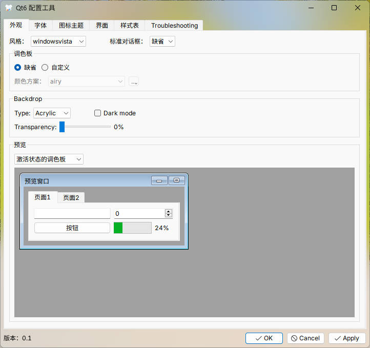
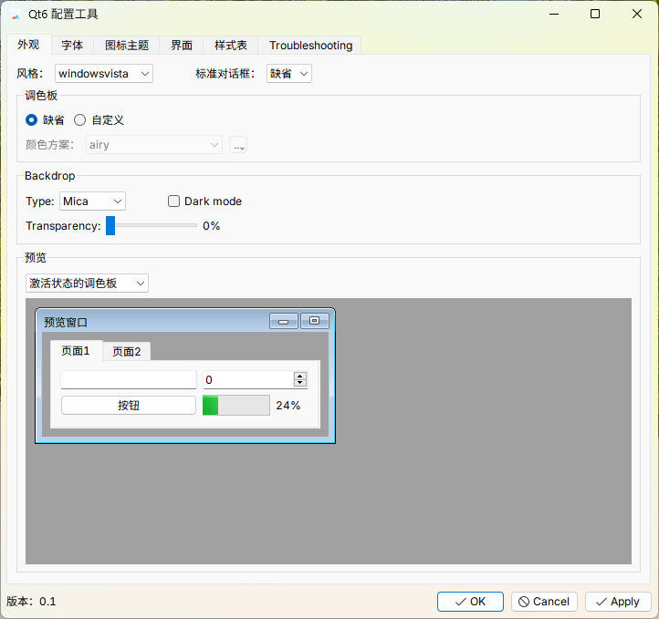
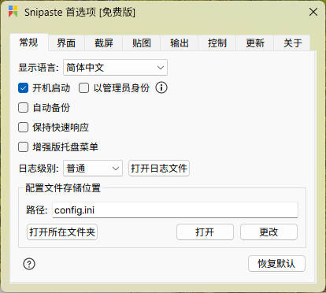

# The famous qt5ct and qt6ct is on windows!

This tool works for both qt5 and qt6.

Remember you can **not** mix different environment together (by which I mean MSVC or mingw). The apps have to be compiled with the same compiler that compiles qtct.

You can find several new styles in [qtstyleplugins](https://code.qt.io/cgit/qt/qtstyleplugins.git/) (You need to compile with the same compiler)

You can put icons theme in `~\.icons`

For kvantum, you can use [kvantum-for-windows](https://github.com/RichardLuo0/kvantum-for-windows)

## Installation
* Download the latest release and extract in a folder.
* Set env variable `QT_QPA_PLATFORMTHEME=qtct`.
* Set env variable `QT_STYLE_OVERRIDE=qtct-style`.
* Or Go to each app path and create a soft link from `<qtct path>/styles` to `<your app path>\styles` and for `platformthemes` as well. (Instead setting env variable `QT_PLUGIN_PATH=<path to your qtct>;` has the same effect. However, doing so overwrite the app custom plugin path.)
* **Notice: if selected style is not applied to certain apps, its most probably that the app hardcoded its own style. You will have to compile from source, download the source, set the content of `src\qtct-style-hack\qtct.json` to the style that the application is using, compile and replace the original style with `styles/qtct-style-hack.dll` in the app directory styles. (My release version contains hack for breeze theme, which is default to kde apps)**

## Files and Directories

* `qtct.exe` - Qt configuration tool
* `platformthemes/qtct.dll` - qtct platform plugin
* `styles/qtct-style.dll` - qtct proxy style plugin
* `%LocalAppData%/qtct/qtct.conf` - configuration file
* `%LocalAppData%/qtct/qss`, `%LocalAppData%/qtct/colors`, `share/qss`, `share/colors` style sheets and colors
* `mklink.bat` drag app folder on it to auto create soft link into app folder.

## Screenshots
 \
 \
 \
